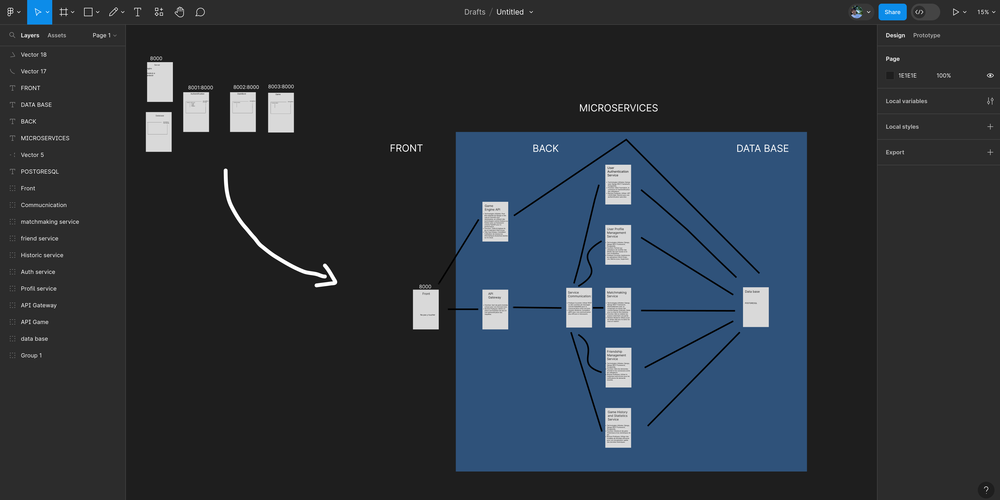

# MicroService

> axel

## Objective

Separate the files so that everything is encapsulated in very distinct modules and thus modify them without touching the rest!

## PATH Idea

Je n'ai pas arreter de changer ma structure des microservices en SPA a force de me documenter
voici l'evolution:

## Folders

DOCKER-COMPOSE: which brings together everything

FRONT :
    - Docker Nginx
    - Static files (html, js, bootstrap)
    - Node.js to use npm

AUTHENTIFICATION:
    - Docker Python
    - Django (requirement.txt, env, auth)

PROFILE:
    - Docker Python
    - Django (requirement.txt, env, auth)

DATA_BASE:
    - Docker PostgreSQL

Les erreurs:

    - 'backports.zoneinfo', c'est une erreur de version python
    lors du push d'un autre pc, il suffit de supprimer la ligne:
    "backports.zoneinfo==0.2.1" dans requirement.txt

Les debug:

    - Pour Django aller au niveau de manage.py puis
    lancer "python3 manage.py migrate" une fois
    puis "python3 manage.py runserver" pour que
    l'appli soit ouverte sur le port 127.0.0.1:8000
    avec le debug sur le terminal en IRL